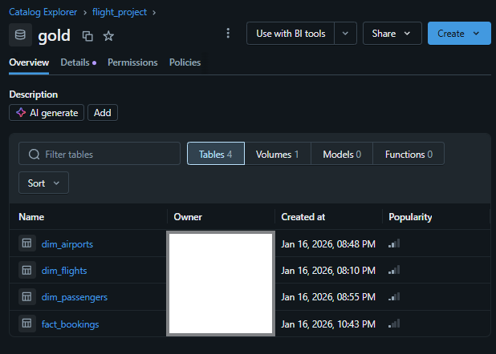

# Databricks Medallion ETL Project (Raw → Bronze → Silver → Gold)

## Overview
This project is an end-to-end ETL pipeline built in Databricks using the Medallion Architecture.  
It starts from raw CSV files, ingests incremental data into Bronze using streaming, transforms data in Silver using Lakeflow Declarative Pipelines, then builds Gold tables with SCD logic.

## Project Flow (High Level)
1. Upload raw CSV files into Databricks Raw schema volume
2. Ingest raw → Bronze using a Databricks Workflow job (`BronzeIngestion`)
3. Transform Bronze → Silver using Lakeflow Declarative Pipeline (Python files)
4. Build Gold Fact and Dim tables using SCD notebooks

---

## Datasets (Raw Layer)
Uploaded into the Raw schema volume:

### Dimension Files
- `dim_airports.csv`
- `dim_airports_increment.csv`
- `dim_airports_scd.csv`
- `dim_flights.csv`
- `dim_flights_increment.csv`
- `dim_flights_scd.csv`
- `dim_passengers.csv`
- `dim_passengers_increment.csv`
- `dim_passengers_scd.csv`

### Fact Files
- `fact_bookings.csv`
- `fact_bookings_increment.csv`

---

## Bronze Layer (Incremental Streaming Ingestion)
Bronze ingestion is handled by a Databricks Workflow job called:

### Workflow Job
- `BronzeIngestion`

### Notebooks (DAG)
1. `SrcParameters`  
   - Prepares the source parameters (list of datasets, paths, configs)
   - Output is used to drive the ingestion loop

2. `BronzeLayer`  
   - Performs incremental ingestion using `readStream` and `writeStream`
   - Runs in a loop using the parameter output from `SrcParameters`

### Output
- Incremental Bronze Delta tables stored in the Bronze schema volume

---

## Silver Layer (Lakeflow Declarative Pipeline)
Silver transformations are built using Databricks Lakeflow Declarative Pipeline.

### Transformation Files
Located in the source code / transformations folder:

- `bookings.py`
- `flights.py`
- `passengers.py`
- `airports.py`

### Flow
Each file follows this pattern:
1. Stage raw Bronze stream
2. Create transformation views
3. Generate streaming tables

### Output
- Streaming tables created and stored in the Gold schema target (pipeline output target)

---

## Gold Layer (SCD + Final Tables)
Gold layer is created using 2 notebooks focused on Slowly Changing Dimensions (SCD).

### Gold Notebooks
- `gold_fact`
- `gold_dim`

### Output
- Final Gold fact tables
- Final Gold dimension tables with SCD handling

---

## Tech Stack
- Databricks
- PySpark
- Delta Lake
- Databricks Workflows (Job DAG)
- Lakeflow Declarative Pipelines (DLT style)
- Streaming ingestion (`readStream`, `writeStream`)
- SCD logic for Gold dimensions

---

## Architecture
Add your screenshots here:

Workflow (BronzeIngestion Job DAG)  

Medallion Flow (Raw → Bronze → Silver → Gold)  

---

## How to Run
### Step 1: Upload Raw Files
Upload the CSV files into your Raw schema volume.

### Step 2: Run Bronze Ingestion Workflow
Run the Databricks Workflow job:
- `BronzeIngestion`

This will execute:
- `SrcParameters`
- `BronzeLayer` (looped per dataset)

### Step 3: Run Silver Lakeflow Declarative Pipeline
Run the Lakeflow Declarative Pipeline using:
- `bookings.py`
- `flights.py`
- `passengers.py`
- `airports.py`

### Step 4: Run Gold Notebooks
Run the Gold notebooks:
- `gold_dim`
- `gold_fact`

---

## Outputs (Add Proof Screenshots)
- Bronze Delta tables created
- Silver streaming tables created
- Gold fact and dimension tables created with SCD applied

Example:

---

## Skills Demonstrated
- Built a Medallion Architecture pipeline (Raw, Bronze, Silver, Gold)
- Implemented incremental ingestion using Spark Structured Streaming
- Orchestrated notebook execution using Databricks Workflows (DAG)
- Built transformations using Lakeflow Declarative Pipelines
- Applied SCD logic to dimension tables in the Gold layer
- Organized ETL code into reusable notebook and transformation modules

## Notes

- This project is for learning and portfolio practice.

- The pipeline design can be reused for any dataset that needs incremental ingestion, transformation, and SCD handling.